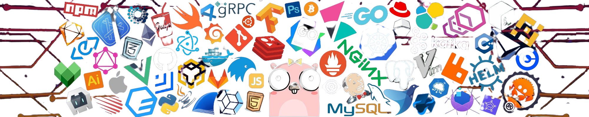

 &nbsp;&nbsp;  &nbsp;&nbsp;

  

  </img>

<!--coding logo

<!--states

<!--contact symbol

-->
 

  <h2 align="center">ABOUT MYSELF </h2> 
  

 

- :credit_card: My self ***Narendra***, an ordinary student
- :school: Currently I am studing Btech in Artificial Intelligence at **Chandigarh Group Of Colleges, Mohali**
- :school: In past I have completed my *Diploma in Mechanical Engineering* at ***Loyola Polytechnic [YSRR]*** in Pulivendla.
- :sweat_smile: Don't ask me why you have changed the stream :sweat_smile: 
- :sunglasses: Proud to be an ENGINEER 👍
- :ok_hand: I am good at making new friends 😙
- :point_right: Currently I am focusing on my career. 👈
- :earth_asia: My ultimate goal is to visit every place in the world. *Which may not be completed* 😓
- :books: Actually, I don't use any books because everything is available on the ***Internet***.:sunglasses:
 
 

 
 

<h2 align="center">  WHAT I HAVE COMPLETED  </h2>
 
 
 

- 👉 PROGRAMMING IN PYTHON 
- 👉 PROGRAMMING IN JAVA
- 👉 PROGRAMMING IN C++
- 👉 HTML
- 👉 CSS
- 👉 3D DESINING
 
 

<h2 align="center">  WHAT I WANT TO COMPLETE  </h2>
 
 

- ⭐ SQL 
- ⭐ JAVASCRIPT
- ⭐ BACKEND DEVELOPMENT
- ⭐ .NET
 
 

<h2 align="center">  MY CODING STATUS  </h2>

 
 

 
 

  
   
   
  
  

 
 
 
<h2 align="center">
  CONNECT WITH ME  </h2>
 
<h3 align="center">SOCIAL MEDIA</h4>

  

  
  
  

 
 
 
<h3 align="center">CODING PLATFORMS</h3>

  
  
  
  

 
 
 

    

    

<h3 align="center">FEELING HAPPY TO SEE YOU HERE..😅</h3>

